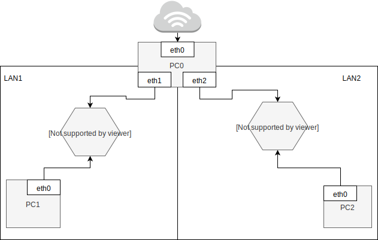

Zadanie 1
---------

1. Zaprojektuj oraz przygotuj prototyp rozwiązania z wykorzystaniem oprogramowania ``VirtualBox`` lub podobnego. 
Zaproponuj rozwiązanie spełniające poniższe wymagania:
   * Usługodawca zapewnia domunikację z siecią internet poprzez interfejs ``eth0`` ``PC0``
   * Zapewnij komunikację z siecią internet na poziomie ``LAN1`` oraz ``LAN2``
   * Dokonaj takiego podziału sieci o adresie ``172.22.128.0/17`` aby w ``LAN1`` można było zaadresować ``500`` adresów natomiast w LAN2 ``5000`` adresów    
   * Przygotuj dokumentację powyższej architektury w formie graficznej w programie ``DIA``

  Podział sieci
 --------------
 | Sieć |  Adres   | Zakres | Adres Rozgłoszeniowy   | 
 | --------- |-------------|  --------- |:-------------| 
 |LAN1|172.22.160.0/23|172.22.160.1 - 172.22.161.254|172.22.159.255|
 |LAN2|172.22.128.0/19|172.22.128.1 - 172.22.159.254|172.22.161.255|
 
 Przygotowanie PC0
 ----------
 * eth0 : Zapewnia dostawca
 * Nadanie adresu ip eth1: ip addr add 172.22.160.1/23 dev enp0s8
 * Nadananie adresu ip eth2 : ip addr add 172.22.128.1/19 dev enp0s9
 Postawienie interfejsów:
 * ip link set enp0s3 up
 * ip link set enp0s8 up
 * ip link set enp0s9 up
 * Uruchomienie ip forwarding : echo 1 >/proc/sys/net/ipv4/ip_forward
 * Masquerade LAN1 : iptables -t nat -A POSTROUTING -s 172.22.160.0/23 -o enp0s3 -j MASQUERADE
 * Masquerade LAN2: iptables -t nat -A POSTROUTING -s 172.22.128.0/19 -o enp0s3 -j MASQUERADE
 
  Przygotowanie PC1
 ----------
 * Nadanie adresu ip : ip addr add 172.22.160.2/23 dev enp0s3
 * Ustawienie routingu : ip route add default via 172.22.160.1 dev enp0s3
 
 Przygotowanie PC2
 --------------
 
 * Nadanie adresu ip : ip addr add 172.22.128.2/19 dev enp0s3
 * Ustawienie routingu : ip route add default via 172.22.128.1 dev enp0s3
 
